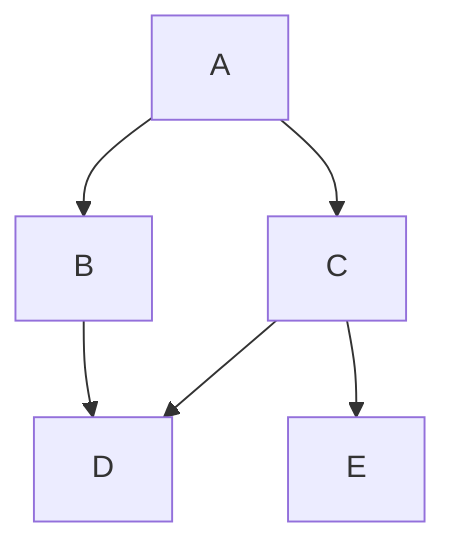

# App Engine Management Center
{: .fs-10 }

In this lab, you will get hands-on experience setting up and managing AEMC.
{: .fs-6 .fw-300 }

We will cover concepts such as Pipelines and Deployments, Onboarding Developers, and Collaborations.
{: .fs-6 .fw-300 }

