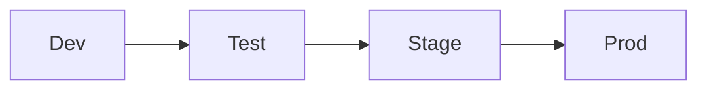

<link rel="stylesheet" href="../style.css">

# Install Requirements
{: .no_toc }

{: .highlight}
> This overview is for information purposes only. 
>
> No activity required.

## Table of contents
{: .no_toc .text-delta }

1. TOC
{:toc}

---

# Prepare environments for App Engine Studio

Before installing App Engine Studio, review all platform requirements and define an organizational instance strategy to prepare for successful installation and configuration.

# Review platform requirements
- App Engine Studio Version 22.0.3
- App Engine license required
  -	Contact your ServiceNow Account Manager for additional information on App Engine, or see [ServiceNow App Engine](https://www.servicenow.com/products/now-platform-app-engine.html)
- Instances must be on Tokyo release
- **admin** role is required in all instances to install App Engine Studio and dependent applications from the ServiceNow Store

# Define instance strategy
When defining the instance strategy for App Engine Studio, it is recommended to leverage one production instance and at least two sub-production instances – however App Engine Studio can support any number of sub-production instances as part of an instance strategy.

Applications are deployed to the production instance once developed and successfully tested in sub-production instances. One sub-production instance will serve as the development environment, and the other as the test environment.

If your organization uses sandbox or staging environments in addition to test and development, they can be incorporated to the instance strategy accordingly based on organizational needs.

{: .fs-6 .fw-300 }